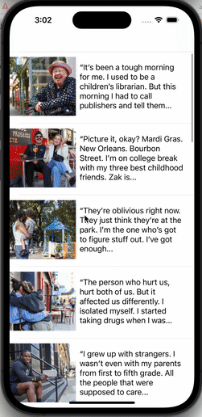

# Project 6 - *Tumblr Blog*

Submitted by: **Tamara Regalado Quiroz**

**Tumblr Blog** is an app that is an app that displays tumblr blogs at the palm of your hands

##  Features
- [x] App has a configured table view and table view call
- [x] App populates the table view with data fetched from an API
- [x] Setup navigation to the Detail Screen
- [x] Created the Detail View UI
- [x] Add the ability to pass data to the Detail View Controller
- [x] Made personal finishing touches to the UI

## Video Walkthrough

## License

    Copyright [2023] [Tamara Regalado Quiroz]

    Licensed under the Apache License, Version 2.0 (the "License");
    you may not use this file except in compliance with the License.
    You may obtain a copy of the License at

        http://www.apache.org/licenses/LICENSE-2.0

    Unless required by applicable law or agreed to in writing, software
    distributed under the License is distributed on an "AS IS" BASIS,
    WITHOUT WARRANTIES OR CONDITIONS OF ANY KIND, either express or implied.
    See the License for the specific language governing permissions and
    limitations under the License.
